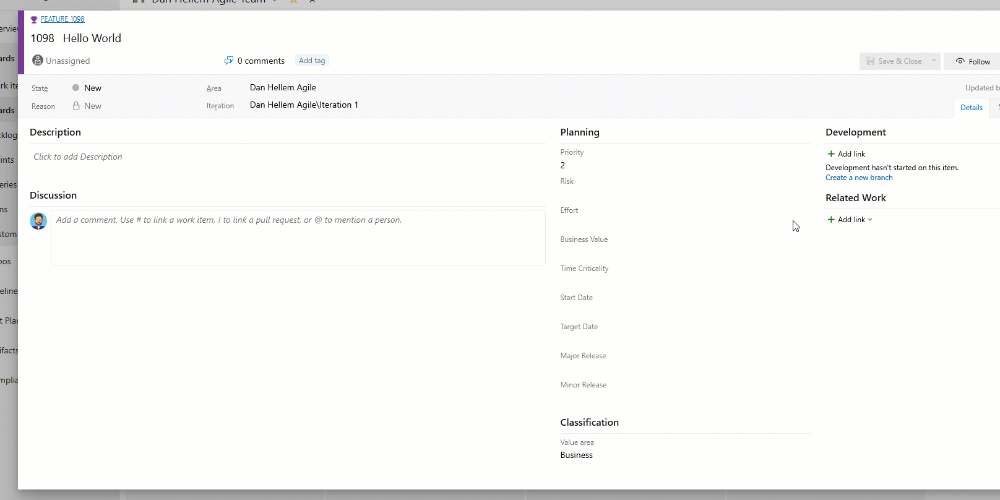
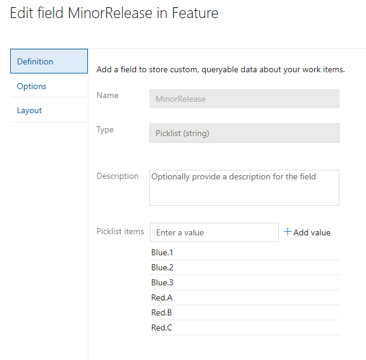
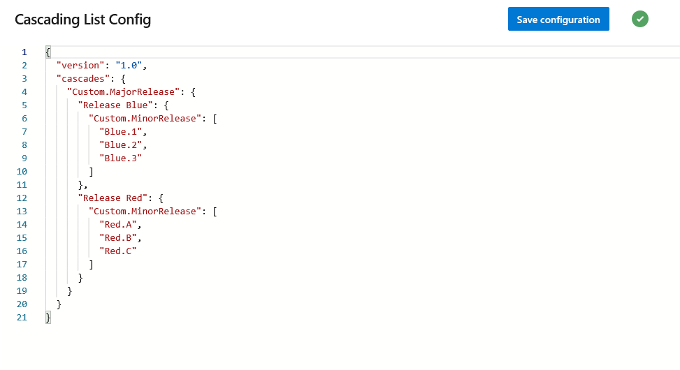

# Cascading Picklists Extension

Have you ever wanted to have a picklist show only subset of values depending on the value of another field? For example maybe you two fields to track a release, major and minor release. The minor release values are tied to the major release values. In the example below, if the major release is "Blue" then only show the Blue minor releases. And when the major release of "Red" is selected, then only show the Red minor releases.


# Documentation 

For detailed instructions on using the Cascading Picklists Extension Azure DevOps extension, please refer to the official documentation. You can access the comprehensive guide by clicking [Market place](https://marketplace.visualstudio.com/items?itemName=ms-devlabs.cascading-picklists-extension). This resource provides step-by-step information to help you effectively utilize the Cascading Picklists Extension features within your Azure DevOps environment.


Note that the extension is only supported on Azure DevOps Service. Is it is currently not supported on-prem yet due to a missing API.

## Cascading Picklists

This extension uses the `ms.vss-work-web.work-item-form` contribution point that enables you to build a cascading picklist on the work item form. Cascading picklists are made up of two seperate fields. The parent field and a child field. The parent picklist will contain a list of values, that when a value is selected, will display the values in the child list.



### Create a picklist

First, create a picklist of parent values. Second, create a picklist of child values. This child picklist will contain **all** possible values. We will configure how those values get displayed in the extension configuration.



### Configure

Once both picklists have been created and configured, you can configure what child picklist values will be displayed. You do this by going to the "Cascading Lists" Hub in project settings. From here, configure the value for the parent picklist, so that when selected, the child values will be displayed.



Config example:
```json
{
  "version": 1,
  "cascades": {
      "Custom.MajorRelease": {
          "Release Blue": {
              "Custom.MinorRelease": [
                  "Blue.1",
                  "Blue.2",
                  "Blue.3"
              ]
          },
          "Release Red": {
              "Custom.MinorRelease": [
                  "Red.A",
                  "Red.B",
                  "Red.C"
              ]
          }
      }
  }
}
```

#### Tips

1. You must know the refname of the custom picklist fields. You can use [List Fields REST API](https://docs.microsoft.com/en-us/rest/api/azure/devops/wit/fields/list?view=azure-devops-rest-5.0) if you need help finding the value.

2. The values setup in the picklist and the values in the configuration must be an exact match. There is no validation to check or correct spelling mistakes in the values.

## Get started with Extensions

Building and testing the extension requires following.

1.  [Download and install NodeJS](http://nodejs.org 'NodeJS Website')
2.  [Install tfx-cli](https://docs.microsoft.com/en-us/vsts/extend/publish/command-line?view=vsts)

```
npm i -g tfx-cli
```

Install dev prerequisites

```
npm install
```

### Create vsix to deploy on test environment

```
npm run build
```

### Run the extension 

```
npm run start
npm run serve-dev
```

### Publish the dev extension to marketplace

Follow the instructions here:

[Package, publish, unpublish, and install Azure DevOps extensions
](https://docs.microsoft.com/en-us/azure/devops/extend/publish/overview?view=azure-devops)

# Support

## How to file issues and get help

This project uses [GitHub Issues](https://github.com/microsoft/azure-devops-extension-cascading-picklist/issues) to track bugs and feature requests. Please search the existing issues before filing new issues to avoid duplicates. For new issues, file your bug or feature request as a new Issue. 


## Contributing

We welcome contributions to improve the Cascading Picklists for Azure DevOps extension. If you would like to contribute, please fork the repository and create a pull request with your changes. Alternatively, you can contact us to request the necessary permissions for direct access to the repository. Your contributions help enhance the functionality and usability of the extension for the entire community.


## Microsoft DevLabs
Microsoft DevLabs is an outlet for experiments from Microsoft, experiments that represent some of the latest ideas around developer tools. Solutions in this category are designed for broad usage, and you are encouraged to use and provide feedback on them; however, these extensions are not supported nor are any commitments made as to their longevity.


